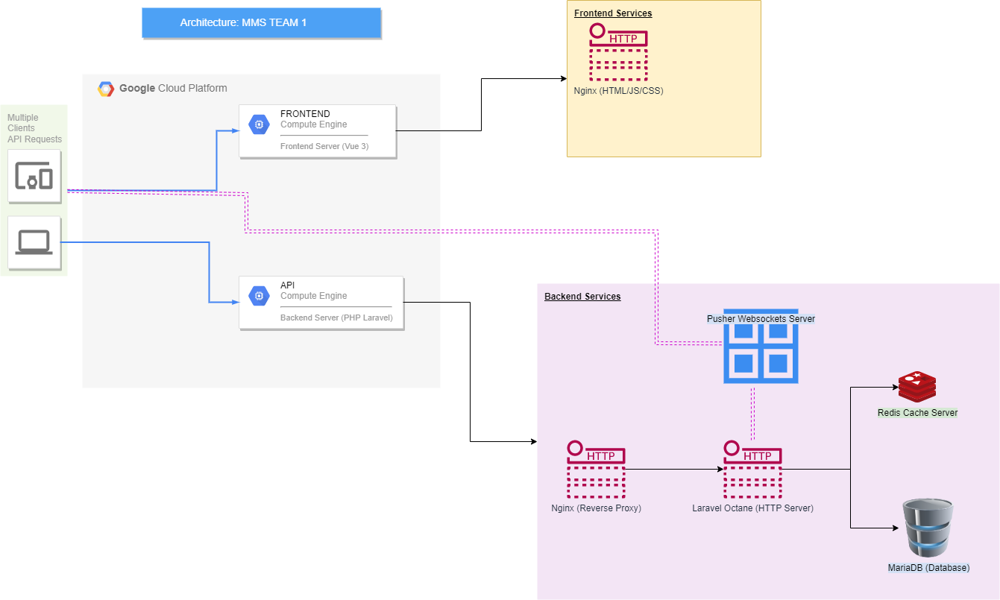

# Admin Backend for MMS (Mentor Management System)

## Installation

### Prerequisites

-   PHP 8.1 or higher
-   Composer

### Installation

1.  Clone the repository
2.  Run `composer install` to install the dependencies
3.  Copy `.env.example` to `.env` and fill in the database credentials
4.  Run `php artisan key:generate` to generate the application key
5.  Create a database and run `php artisan migrate`
6.  Run `php artisan db:seed` to seed the database with test data

## Usage

### Development

1.  Run `php artisan serve` to start the development server or use Laravel Valet or Laravel Homestead

## API Response Format

We have included an APIResource class [Here](app/Http/Resources/ApiResource.php) whose purpose is to ensure that all API responses are consistent. To use it, simply extend the class and implement the `toArray()` method. The `toArray()` method should return an array with the following structure:

Example:

```php
return new ApiResource([
    // Put your data here
    'username' => 'username',
    'email' => 'email',

    // Optional
    'links' => [
        // Links to other resources
    ],
    'meta' => [
        // Meta data
    ],
    'message' => 'Used for success message',
]);
```

Incase you need to return an error, then the response should be in the following format:

```php
return new ApiResource([
    // An array of errors, used for validation errors and other errors
    'errors' => [
        'username' => 'Username is invalid'
    ],
    'error' => 'error message if it is a single error'
    'status' => 500, // Very important, this is used to set the HTTP status code
]);
```

Incase you need to return a paginated response, you can simply pass the paginator instance to the constructor:

```php
return new ApiResource(User::paginate(10));
```

## Docker

### Prerequisites

-   Docker

### Installation

Since we are using laravel vail, a docker-compose.yml file is already included in the project. To start the development server, run `docker-compose up -d` and then run `docker-compose exec app php artisan serve --host=127.0.0.1 --port=8000` to start the development server.

## Architecture

Our project is hosted in GCP, both frontend and backend use GCP compute instances. The instances both have a script to pull changes from the repository and deploy them.

The instances have currently been assigned a static IP address, so they can be accessed from any location.

Both frontend and backend have DNS records pointing to them, so they can be accessed using a domain name. Moreover we use LetsEncrypt to generate SSL certificates for the domain names.

Below is a diagram showing the architecture of the project.



### Frontend

Frontend contains only Nginx which is used to host the compiled version of Vue3 app. The app is compiled using `npm run build` and the compiled files are placed in the `dist` folder. The `dist` folder is then served by Nginx.

### Backend

Backend contains 5 services which are:

1.  Nginx (Acts purely as reverse proxy in this case)
2.  Laravel Octane (Used to serve the Laravel app on localhost)
3.  Redis (Used for caching)
4.  MariaDB (Used for storing data)
5.  Pusher websocket server (Used for realtime notifications)

The apps are served using Laravel Octane. Laravel Octane is a high performance application server for Laravel. It is built on top of Swoole, a production-grade async PHP runtime. It is used to serve the Laravel app on localhost.

For websockets we use Pusher websocket server. It is used for realtime notifications. It also enables us to use Laravel Echo to listen for events, such as typing events.

## API Documentation

The API documentation can be found [Here](https://www.postman.com/skillcatapp/workspace/andela-mms-team-1/collection/6607119-72a52e5f-0dd0-4316-bfa6-32796ca187ff?action=share&creator=6607119)

## Future recomendations

There are many things that can be improved on the project. Below are the major concerns I feel still need a bit of work.

1.  The API documentation is not complete. I have only documented the endpoints that I have used in the frontend. I have not documented the endpoints that I have not used in the frontend.
2.  Roles need to be nailed down and implemented. Currently, I have only implemented the admin role. I have not implemented the other roles. This is because I am not sure what the other roles are supposed to do or how the affect the system.
3.  Adding @ mentions is also something that needs to be implemented. Currently, I have only implemented the ability to add a comment. I have not implemented the ability to mention a user in a comment.
4.  Additional improvement on text editor to support other formats e.g. Markdown and LaTeX.
5.  Add ability to customize things such as email templates which is currently unavailable.
6.  Tighten role permissions. This includes clearly defining what each role can do and what they cannot do.
7.  Adding meilisearch to improve search functionality. This will enable a much more robust full text search.

## License

The Laravel framework is open-sourced software licensed under the [MIT license](https://opensource.org/licenses/MIT).

## Contributing

Thank you for considering contributing to the MMS Admin Backend! The contribution guide can be found in the [MMS Admin Backend documentation](../../README.md).

Once you have cloned the repository, you can run `composer install` to install the dependencies. You can then run `php artisan serve` to start the development server.

Please make sure to write tests for your code and to follow the [PSR-2 Coding Style Guide](https://www.php-fig.org/psr/psr-2/).

All changes should be made using the feat/ or fix/ prefix. For example, if you are adding a new feature, you should create a branch called feat/new-feature. If you are fixing a bug, you should create a branch called fix/bug-description.

Note: **Do not make changes to the master branch.**

Note: **Once you have finished making your changes, you need to fix the code styling by running `php-cs-fixer fix` and then commit your changes. You also need to run `composer test` to make sure all tests are passing. You can then push your changes to your fork and create a pull request.**

## Security Vulnerabilities

If you discover a security vulnerability within MMS Admin Backend, please open an issue. All security vulnerabilities will be promptly addressed.

## Code of Conduct

In order to ensure that the MMS Admin Backend community is welcoming to all
